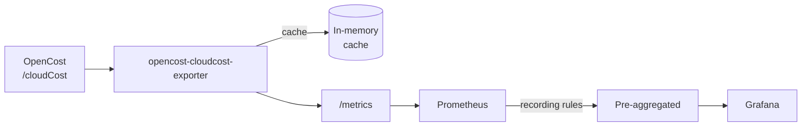

# OpenCost CloudCost Exporter

A Prometheus exporter that bridges [OpenCost](https://www.opencost.io/) cloud cost data with your observability stack. It scrapes AWS cloud costs from OpenCost's `/cloudCost` API and exposes them as Prometheus metrics, enabling cost monitoring, alerting, and visualization in Grafana.

> [!NOTE]
> Currently only **AWS** cloud provider is supported. GCP and Azure support may be added in future releases.

## Key Features

- **Multi-dimensional cost metrics** — Break down costs by account, service, region, environment, owner, and cluster
- **Intelligent caching** — Configurable TTL and stale-while-revalidate pattern to minimize API load
- **Pre-aggregated recording rules** — 22 Prometheus recording rules for fast dashboard queries
- **Cost optimization insights** — Compare list vs. amortized costs to track reservation/discount savings
- **Currency exchange rates** — Real-time USD conversion rates for multi-currency visibility
- **Production-ready** — Helm chart with ServiceMonitor, PrometheusRule, health checks, and graceful shutdown

## Architecture



## Prerequisites

> [!IMPORTANT]
> **OpenCost must be installed and running** before using this exporter. The exporter fetches cloud cost data from OpenCost's `/cloudCost` API endpoint.

1. **Install OpenCost** — Follow the [OpenCost installation guide](https://www.opencost.io/docs/installation/install)
2. **Enable AWS Cloud Cost integration** — Configure OpenCost to collect AWS cloud costs via the Cost and Usage Report (CUR)
3. **Verify OpenCost is accessible** — The exporter needs network access to OpenCost's API (default: `http://opencost.opencost:9003`)

## Installation

### Using Helm (Recommended)

```bash
# Add the Helm repository (if published) or use local chart
helm install opencost-cloudcost-exporter ./charts/opencost-cloudcost-exporter \
  --namespace opencost \
  --set opencost.url=http://opencost.opencost:9003

# With custom values
helm install opencost-cloudcost-exporter ./charts/opencost-cloudcost-exporter \
  --namespace opencost \
  -f my-values.yaml
```

### Using Docker

```bash
docker run -p 9100:9100 ghcr.io/hawky4s/opencost-cloudcost-exporter:latest \
  --opencost-url=http://opencost:9003
```

### Binary

```bash
# Download from releases or build locally
./opencost-cloudcost-exporter --opencost-url=http://localhost:9003
```

## Verifying the Installation

```bash
# Check metrics endpoint
curl http://localhost:9100/metrics | grep aws_cloud_cost

# Check health
curl http://localhost:9100/healthz

# Check readiness
curl http://localhost:9100/readyz
```

## Configuration

| Flag                          | Environment                 | Default                         | Description                       |
|-------------------------------|-----------------------------|---------------------------------|-----------------------------------|
| `--opencost-url`              | `OPENCOST_URL`              | `http://opencost.opencost:9003` | OpenCost service URL              |
| `--port`                      | `PORT`                      | `9100`                          | Metrics server port               |
| `--window`                    | `WINDOW`                    | `2d`                            | Time window for cost queries      |
| `--aggregate`                 | `AGGREGATE`                 | `service,category`              | Aggregation dimensions            |
| `--cache-ttl`                 | `CACHE_TTL`                 | `1h`                            | Cache TTL                         |
| `--max-stale`                 | `MAX_STALE`                 | `6h`                            | Maximum age for stale data        |
| `--emit-kube-percent-metrics` | `EMIT_KUBE_PERCENT_METRICS` | `false`                         | Emit Kubernetes percent metric    |
| `--currency-symbols`          | `CURRENCY_SYMBOLS`          | `CNY,EUR`                       | Target currency symbols for FX    |
| `--log-level`                 | `LOG_LEVEL`                 | `info`                          | Log level (debug/info/warn/error) |

## Metrics

### Cost Metrics

| Metric                              | Description                                  |
|-------------------------------------|----------------------------------------------|
| `aws_cloud_cost_total`              | AWS cloud cost in USD                        |
| `aws_cloud_cost_kubernetes_percent` | Percentage attributed to Kubernetes (opt-in) |
| `currency_exchange_rate`            | Currency exchange rates (USD base)           |

**Labels**: `provider_id`, `account_id`, `service`, `category`, `cost_type`, `region`, `availability_zone`, `owner`, `environment`, `cluster`

**Cost Types**: `list`, `net`, `amortized_net` (recommended), `invoiced`, `amortized`

### Self-Observability Metrics

| Metric                                       | Type      | Description                        |
|----------------------------------------------|-----------|------------------------------------|
| `cloudcost_exporter_info`                    | Gauge     | Build info (version, commit, date) |
| `cloudcost_exporter_scrape_duration_seconds` | Histogram | Time to fetch from OpenCost        |
| `cloudcost_exporter_scrape_errors_total`     | Counter   | Failed scrapes                     |
| `cloudcost_exporter_cache_hits_total`        | Counter   | Cache hits                         |
| `cloudcost_exporter_cache_age_seconds`       | Gauge     | Age of cached data                 |

## Helm Chart

The chart includes:
- **ServiceMonitor** for Prometheus Operator
- **PrometheusRule** with recording rules and alerts

### Recording Rules

Pre-aggregated metrics for dashboard performance:

**Single Dimension:**
- `aws_cloud_cost:by_owner:daily`
- `aws_cloud_cost:by_service:daily`
- `aws_cloud_cost:by_region:daily`
- `aws_cloud_cost:by_environment:daily`
- `aws_cloud_cost:by_category:daily`
- `aws_cloud_cost:by_cluster:daily`
- `aws_cloud_cost:by_account:daily`
- `aws_cloud_cost:total:daily`

**Multi-Dimension:**
- `aws_cloud_cost:by_owner_service:daily`
- `aws_cloud_cost:by_owner_region:daily`
- `aws_cloud_cost:by_owner_environment:daily`
- `aws_cloud_cost:by_service_region:daily`
- `aws_cloud_cost:by_service_category:daily`
- `aws_cloud_cost:by_account_service:daily`
- `aws_cloud_cost:by_account_region:daily`

**List Cost & Savings:**
- `aws_cloud_cost_list:by_owner:daily`
- `aws_cloud_cost_list:by_service:daily`
- `aws_cloud_cost_list:by_region:daily`
- `aws_cloud_cost_list:by_environment:daily`
- `aws_cloud_cost_list:by_account:daily`
- `aws_cloud_cost_list:total:daily`
- `aws_cloud_cost:savings:daily`
- `aws_cloud_cost:savings_percent:daily`

### Alerts

- `CloudCostDailySpendHigh` - Daily spend exceeds threshold
- `CloudCostSpike` - Cost spike detection (day-over-day)
- `CloudCostExporterDown` - Exporter is unreachable

## Development

```bash
make build    # Build binary
make test     # Run tests
make lint     # Run linters
make helm-lint # Lint Helm chart
```
