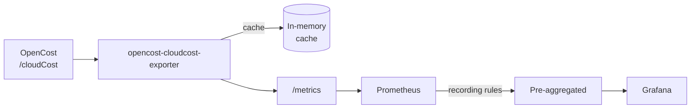
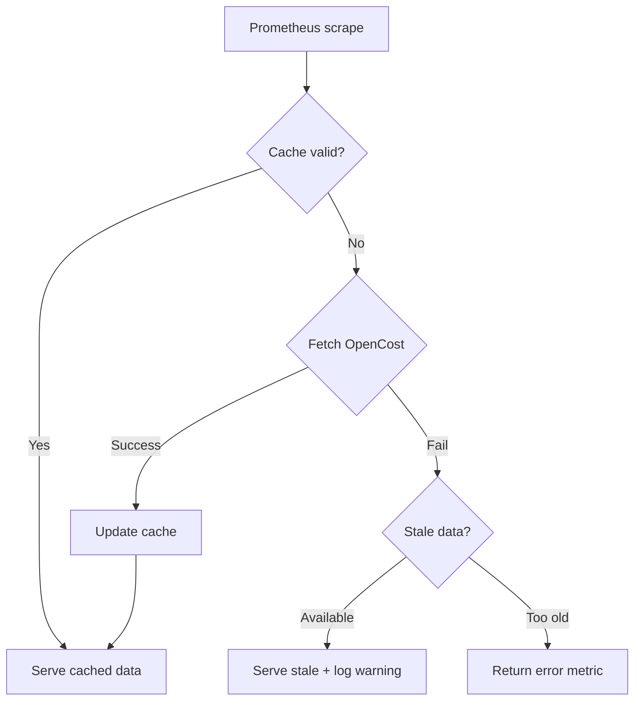

# OpenCost Cloud Cost Prometheus Exporter

A Prometheus exporter that scrapes OpenCost `/cloudCost` API and exposes AWS cloud costs as metrics.

## Architecture



---

## Metrics Design

### Base Metrics

| Metric                              | Labels                                                                                        |
|-------------------------------------|-----------------------------------------------------------------------------------------------|
| `aws_cloud_cost_total`              | `account_id`, `service`, `category`, `cost_type`, `region`, `owner`, `environment`, `cluster` |
| `aws_cloud_cost_kubernetes_percent` | same as above                                                                                 |

### Exporter Self-Observability Metrics

| Metric                                       | Type      | Description                    |
|----------------------------------------------|-----------|--------------------------------|
| `cloudcost_exporter_scrape_duration_seconds` | Histogram | Time to fetch from OpenCost    |
| `cloudcost_exporter_scrape_errors_total`     | Counter   | Failed scrapes                 |
| `cloudcost_exporter_cache_hits_total`        | Counter   | Cache hits                     |
| `cloudcost_exporter_cache_age_seconds`       | Gauge     | Age of cached data             |
| `cloudcost_exporter_last_successful_scrape`  | Gauge     | Unix timestamp of last success |

### Cost Types

| Type            | Use Case                           | Example             |
|-----------------|------------------------------------|---------------------|
| `list`          | Compare to on-demand               | EC2: $0.192/hr      |
| `net`           | Actual spend (with discounts)      | $0.154/hr (20% EDP) |
| `amortized_net` | **Default** - RIs spread over term | $0.103/hr           |
| `invoiced`      | What's on the bill                 | Monthly actual      |

---

## Operational Features

### Caching

Since cloud costs update daily, the exporter caches responses:

```go
type Cache struct {
    data      *CloudCostResponse
    fetchedAt time.Time
    ttl       time.Duration  // default: 1h
}
```

- **TTL**: Configurable via `--cache-ttl` (default: `1h`)
- **Stale serving**: If OpenCost fails, serve stale data up to `--max-stale` (default: `6h`)

### Health Endpoints

| Endpoint   | Purpose   | Checks                              |
|------------|-----------|-------------------------------------|
| `/healthz` | Liveness  | Process is running                  |
| `/readyz`  | Readiness | OpenCost reachable, cache populated |

### Graceful Degradation



### Recommended Scrape Interval

Since costs update daily, aggressive scraping is unnecessary:

```yaml
# Helm values
serviceMonitor:
  interval: 1h  # Recommended
```

---

## Alerting Rules

Deployed via Helm chart alongside recording rules:

```yaml
# charts/opencost-cloudcost-exporter/templates/prometheusrule.yaml
groups:
  - name: cloudcost.alerts
    rules:
      # Daily spend threshold
      - alert: CloudCostDailySpendHigh
        expr: aws_cloud_cost:total:daily > 5000
        for: 1h
        labels:
          severity: warning
        annotations:
          summary: "Daily AWS spend exceeds $5000"

      # Cost spike detection (20% increase)
      - alert: CloudCostSpike
        expr: |
          aws_cloud_cost:total:daily 
          / aws_cloud_cost:total:daily offset 1d > 1.2
        for: 2h
        labels:
          severity: warning
        annotations:
          summary: "AWS costs increased by 20%+ day-over-day"

      # Exporter health
      - alert: CloudCostExporterDown
        expr: up{job="opencost-cloudcost-exporter"} == 0
        for: 15m
        labels:
          severity: critical
```

---

## Cardinality Management

| Dimension     | Cardinality | Notes                   |
|---------------|-------------|-------------------------|
| `provider_id` | ~3500       | **Excluded by default** |
| `owner`       | ~20         | Aggregated              |
| `service`     | 31          | Fixed                   |

**Default aggregation**: `service,category,owner,environment` → **~3,100 series**

---

## Recording Rules

```yaml
groups:
  - name: cloudcost.rules
    rules:
      - record: aws_cloud_cost:by_owner:daily
        expr: sum by (owner) (aws_cloud_cost_total{cost_type="amortized_net"})
      - record: aws_cloud_cost:by_service:daily
        expr: sum by (service) (aws_cloud_cost_total{cost_type="amortized_net"})
      - record: aws_cloud_cost:by_environment:daily
        expr: sum by (environment) (aws_cloud_cost_total{cost_type="amortized_net"})
      - record: aws_cloud_cost:total:daily
        expr: sum(aws_cloud_cost_total{cost_type="amortized_net"})
```

---

## Configuration

| Flag             | Default                         | Description            |
|------------------|---------------------------------|------------------------|
| `--opencost-url` | `http://opencost.opencost:9003` | OpenCost service       |
| `--cache-ttl`    | `1h`                            | Cache TTL              |
| `--max-stale`    | `6h`                            | Max age for stale data |
| `--aggregate`    | `service,owner,environment`     | Aggregation level      |

---

## Project Structure

```
opencost-cloudcost-exporter/
├── AGENTS.md
├── CHANGELOG.md
├── Makefile
├── main.go
├── pkg/{client,collector,cache,types}/
├── docs/
│   ├── implementation_plan.md
│   └── metrics.md
├── charts/opencost-cloudcost-exporter/
│   └── templates/{deployment,prometheusrule}.yaml
└── .github/workflows/pr.yaml
```

---

## Verification

```bash
make test          # Unit tests (TDD)
make lint          # golangci-lint
make docker-build  # Build image

# Verify rules
promtool check rules charts/opencost-cloudcost-exporter/templates/prometheusrule.yaml
```
